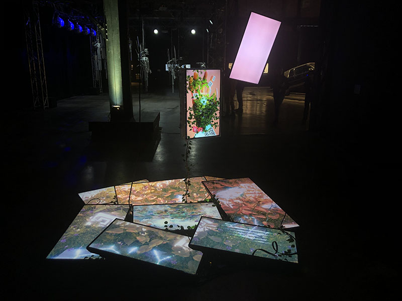

# Nature Morte - Baron Lanteigne
Le 2 février dernier, je me suis rendu au musée Arsenal a montreal.  
Comme vu dans le titre de la fiche, j'ai choisi de vous présenter Nature Morte une piece temporaire et interieure utilisée dans l'évenement de la BIAN 6 par l'artiste 
Québécois Baron Lanteigne créée en 2022  

# Presentation de l'oeuvre
L'oeuvre de Lanteigne est constituée de 9 écrans placés sur le plancher en mode paysage et portrait avec quelques supports pour ne pas abimer les cables hdmi 
et autres relian ces écrans au prises murales. De plus, 2 autres écrans, cette fois ci placé seulement en mode portrait, sont suspendus à environ 1 metre et 
demi du sol.  

# Écrans sur le sol
Les écrans sur le plancher présentent une vidéo separée entre eux, la vidéo est une animation de feuillage et de gazon avec 
quelques morceaux de vitres qui reflète la lumiere et des codes QR disperssés dans le gazon.   

# Effet Glitch
Dans l'animation des écrans sur le plancher, Baron a décidé d'ajouter des animations de "Bug" sur les écrans a l'occasion (voir Photo ci dessou dans l'écran du bas 
Droit).  

# Écran principal
Comme mentionné dans la présentation de l'oeuvre, il y a deux écran suspendu en l'air. Un des deux affiche simplement une vidéo qui laisse a croire quelle 
est brisée

, 

mais l'autre a une grande particularité. le devant du dispositif ou s'attache l'écran nous laisse voir un compartiment 
comme celle d'un ordinateur. L'artiste nous le confirme aussi en inscrivant dans ce meme compartiment "Virtual World Emulation Device" ce qui ce traduit 
comme: Dispositif d'émulation de monde virtuel. Finalement au dos du compartiment, un écran y est attaché oû y est présenté, encore 
une fois sous forme d'animation 3d, une main sur laquelle y pousse des branches d'arbres et de buissons en plus de lui faire pousser des code QR.

# La mise en espace et ses composantes thecnique
Cette piece d'art multimédia contemplatif, comprend un total de 11 écran de 3 tailles differente. Une pour ceux sur le sol, une pour l'écran qui illustre 
un bug et une pour l'écran attaché au compartiment principal. Chacun des écrans nécissite un fil pour la transcription video (préferablement HDMI) en 
plus d'un fil pour y apporter le courant. Donc un total de 22 fils nécessaire pour le montage des écrans.

Mais le musée doit aussi être capanble de 
fournir a la piece une façon d'accrocher les deux écrans qui ne sont pas au sol, par exemple a l'Arsenal, ils ont accrocher les écrans a l'aide de cable 
attacher a une poutre faissant parti de l'architecture de l'endroit.

Cela permet au écran de rester stable et réduit énormement les risques de domages 
aux écrans qui pourrait arriver si les composantes était moin stable, comme nous avons pu le voir lors de la dance des robots instalé à la BIAN. 
Cette piece ne peut être mis collé au mur car nous devons être capable de se déplacer tout autour de l'oeuvre pour voir tout les détails laissé par 
l'artiste mais 
c'est la seule contraite visible qui compliquerais 
l'apréciation de l'oeuvre.  

# Mon expérience vécu
Je trouve que l'oeuvre est très simpliste pour le message, qui lui, est beaucoup plus intense. Visuellement c'est magnifique, le travail fait au niveau 
3d est extremement complex. Ce n'est pas une oeuvre qui est interactive elle est seulement contempatif et elle n'est pas trop stimulante pour les yeux 
comme l'oeuvre Retina de Herman Kolgen qui était tellement difficile pour les yeux a regarder que j'ai du prendre quelque pause durant mon visionement.
C'est oeuvre ma fait pensée au monde virtuel qui prend de plus en plus de place dans notre société, en mettant des bous de vitre 
éclaté dans son animation 3d je crois quil veut nous faire comprendre que peu importe comment le dévelopement technologique avance et nous que sommes capable de
recréer un monde virtuel indentique au notre, ne sera jamais capable de prendre la place du monde réels et mieux vaut se consentrer a prendre soin du monde qu'on a à la place d'essayer d'en créer un utopique ou la vie est parfaite. Un bon exemple d'un monde ou le virtuel est utopique  et le monde réel est délaissé completement est le film " Ready Player One" de Steven Spielberg.  

 # Ce que je retiens de l'oeuvre positivement et négativement
 Cette oeuvre m'inspire pour l'animation 3d qui est un domaine dans lequel j'aime faire des projects. L'instalation solide est quelque chose de tres 
 important pour 
 moi. Devoir revenir a chaque semaine ou meme au deux semaine est d'après moi une grande perte de temps et d'argent pour l'artiste. Par contre, je trouve 
 l'emplacement 
 dans le musée très sombre et aussi une perte d'espace. L'oeuvre prend beaucoup de place pour le but elle apporte et elle aurait pu être mis dans un 
 endroit plus 
 restrait ou du moin plus clair. Une trame sonore pourrais très facilement être intégré à l'aide de haut parleur en haut des écrans suspendus ou à coté 
 de ceux 
 sur le plancher. 
