# Découverte des Projets Mycelium des étudians TIM 3eme année.

5 Projets on été présenté lors de l'événement Mycelium.

## 1. Édria

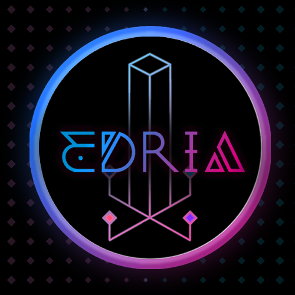
### Créateur(ice)s
- Elwin Durant
- Loic Delmorne
- Dominic Roberts
- Grabriel Leblanc
- Meryem Berbiche
- Jean-Christophe   
#### - Lien avec Mycelium
Sur chacune des tours contruite par le groupe, ils ont mit du faux feuillage qui monte tout au long des tours et des lumieres qui pourrais faire penser 
a des champignon et leurs racines.    
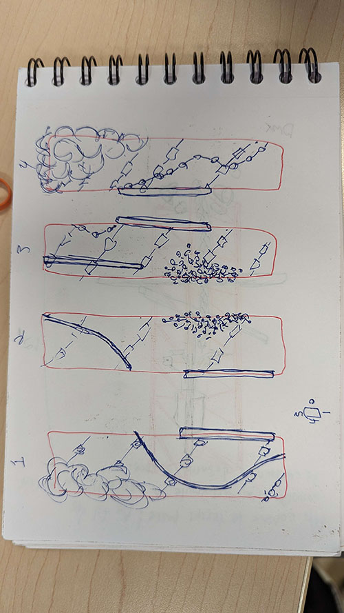    
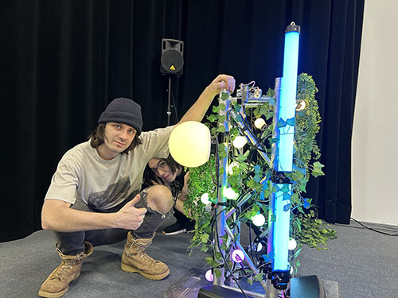

#### - photos lors de la visite
Malheureusement Je n'ai aucune autre photo de la visite suite au fait que j'ai du changer de téléphone à cause d'un bris.(Photo prise du site TIM)     
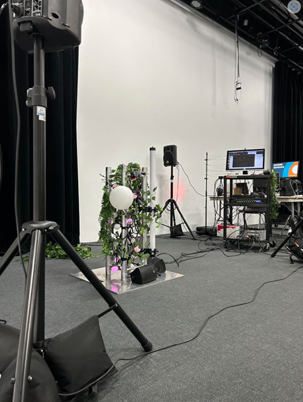

#### - Schéma d'implantation
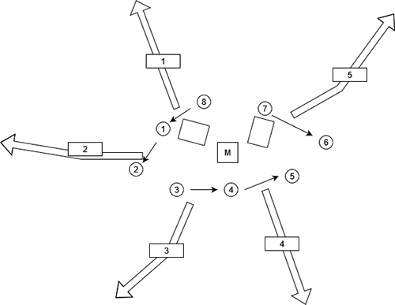
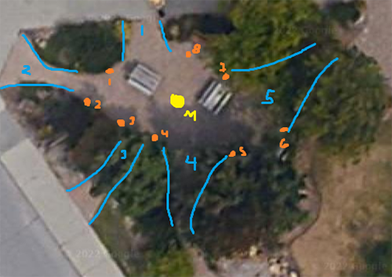

## 2. Zodie-Gal

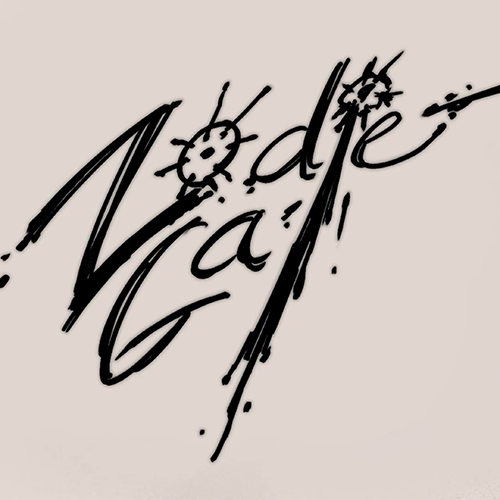

### Créatrice
- Abdanor Yara

#### - Lien avec Mycelium
Aucun puique c'est un jeux video et est un projet à part du projet mycelium

#### - photos lors de la visite
Toutes Les photos sont des dessins disponible sur le site TIM du projet Zodie-Gal. Dans le profil des Zodiacs. Où dans le dossier média de Zodie-Gal    
[TIM Zodie-Gal Zodiac](https://tim-montmorency.com/2023/projets/Zodie-Gal/docs/web/preproduction.html)      
[Github Alexandre Locas Zodie-Gal Média](https://github.com/Alexandre-LocasCEGEP/H23_V13_inspirations_LOCAS/tree/main/Exploration_Mycelium/Zodie-
Gal/Média)

#### - Schéma d'implantation
Le projet Zodie-Gal n'a pas de schéma d'implantation puisque c'est un jeux vidéo. Par contre, elle a dessiner un plan pour le déroulement de son jeux, 
ce qu'on pourrait considérer son schéma s'implantation.  
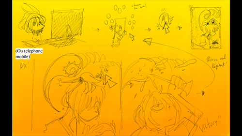

## 3. Nexum
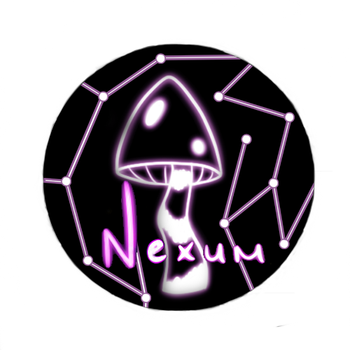

### Créateur(ice)s
- Sébastien Reilly
- Sabrina Laforest
- Alexandre Daniel
- Maxime Des Lauriers

#### - Lien avec Mycelium
Forêt mistique avec des trames sonores pour nous mettre dans l'ambiance complémentée de code QR qui nous rapporte a des dessins d'animeaux faissant 
partie de la Forêt créée par le groupe. Les lumières mis sur le sol peuvent nous faire penser à des sortes de champignons. Ils se sont inspirer des photos suivantes
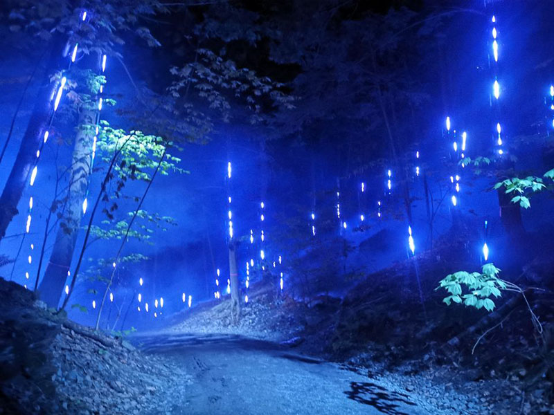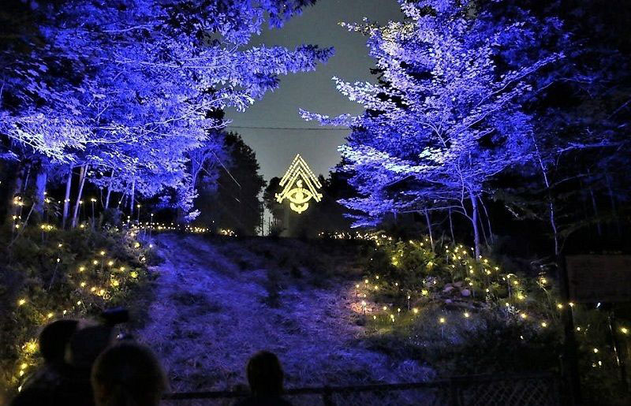
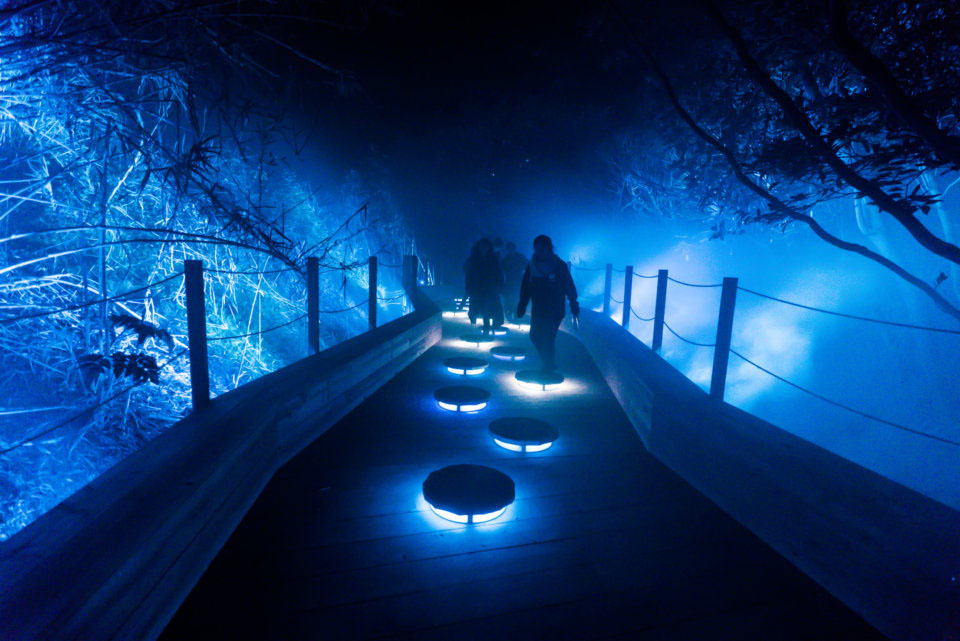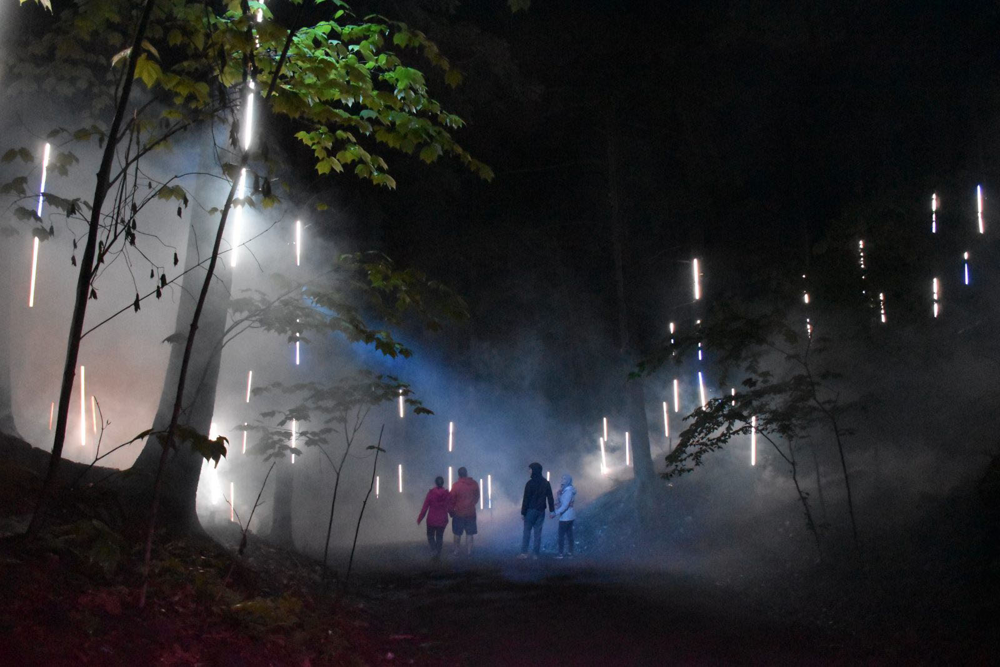
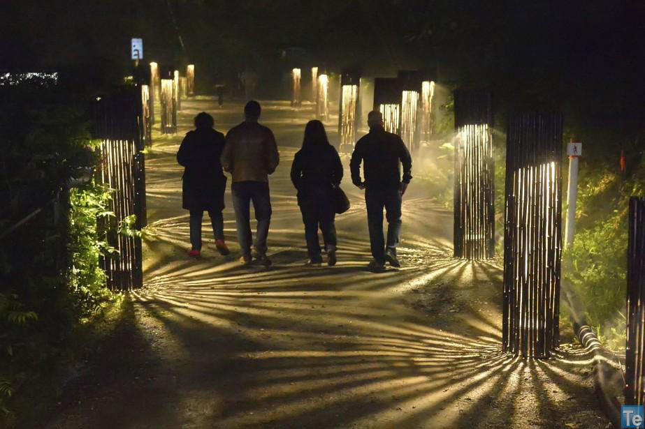

#### - photos lors de la visite
Malheureusement Je n'ai aucune autre photo de la visite suite au fait que j'ai du changer de téléphone à cause d'un bris.
#### - Schéma d'implantation
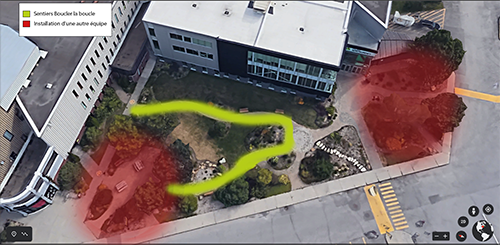

## 4. Luma Sol
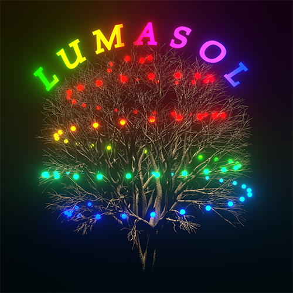

### Créateur(ice)s
- Éloïse Gagné
- Skayla Stimphil
- Michaël Simard
- Pénélope Morrisson

#### - Lien avec Mycelium 
Ils ont mis des fils lumineux du bas de l'arbre comme pour simuler le mycelium d'un champignon.    
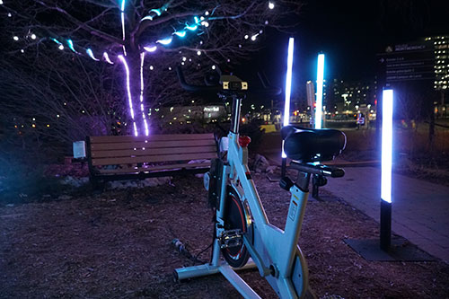

#### - photos lors de la visite
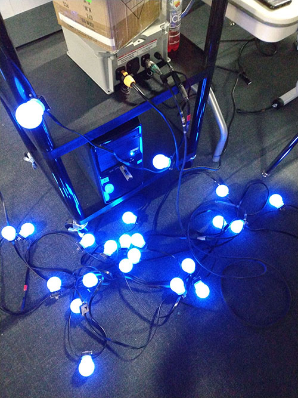
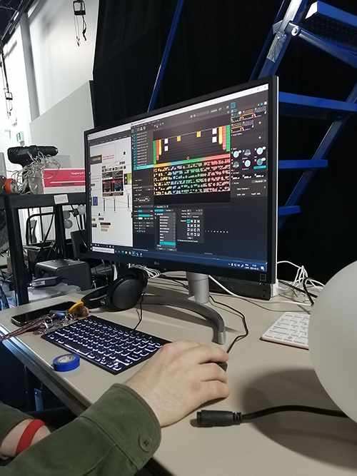

#### - Schéma Informatique
Il n'y a pas de schéma d'implantation.
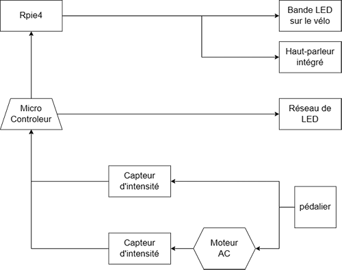

## 5. Echomarine
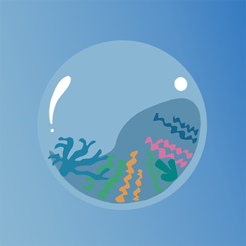

### Créatrices
- Florence Lapierre
- Natacha Abdallah
- Tracy Gua
- Maira Laura Coronel

#### - Lien avec Mycelium
Celui-ci comme Zodie-Gal est un projet à part du projet mycelium, il cherche a sensibiliser les visiteurs a la proche instinction de plusieurs espèces 
marine comme nous pouvons le voir sur ces deux maquettes.
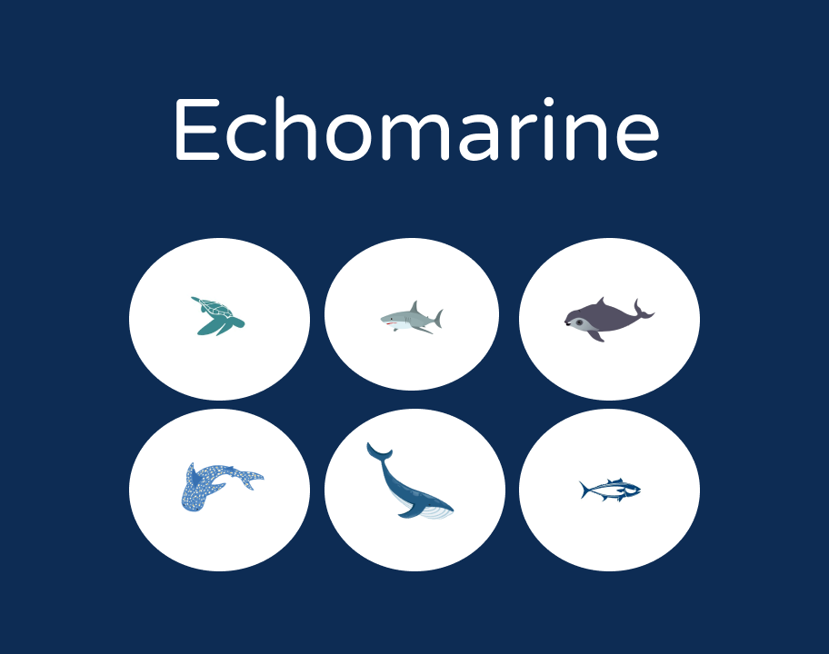
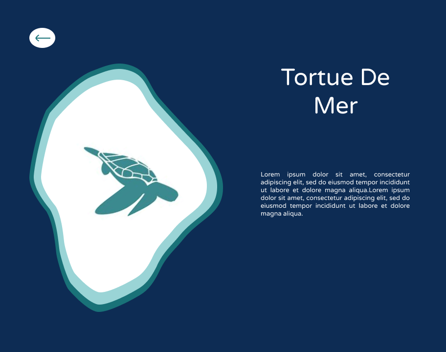
#### - photos lors de la visite
Malheureusement Je n'ai aucune autre photo de la visite suite au fait que j'ai du changer de téléphone à cause d'un bris.    
#### - Schéma d'implantation
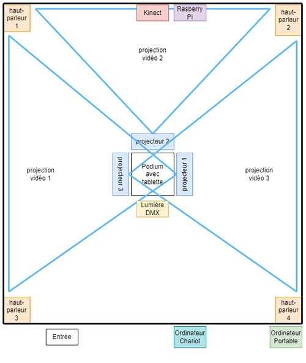

## Apreciation avant la découverte finale des oeuvres
1. Édria était d'après moi l'oeuvre avec le plus de potentiel. L'idée de base est super. Des tours avec detection de mouvement qui crée chaqu'un un 
effet visuel et auditif différent sur une autre tour. Avec ce qu'on a pu voir lors de la visite avec la classe, leur dévoument au projet et le nombre de 
personne qui participaient au projet me laissait croire à ce qu'il devienne le meilleur des cinq.    

2. Zodie-Gal est un jeux vidéo. Ce dommaine m'interresse beaucoup et me donnais beaucoup d'exitement à le voir complété. Le style d'art est, d'après 
moi, super efficace pour le but de son jeux. Après le visionement des vidéos des étudiant en TIM 3eme années, elle avait déjà fini tout son art il 
lui manquait juste a programer le site pour que le jeux soit fonctionnel.   

3. Nexum est une idée qui n'est pas original d'eux. Néanmoin elle reste très complexe a réaliser en une année. Cette contrainte ne m'inspirait pas 
confiance. De plus, les dessins qu'on pouvait retrouver à l'intereur des codes QR n'était pas au meme niveau artistique que le restant de l'oeuvre ce 
qui enlevait de la crédibilité a leur projet.     

4. Luma sol est tout simplement un vélo qu'on vient utiliser et il active differentes séquence de lumières dépendant la saison déterminer. Je trouve ce 
concept tres simpliste considerant le nombre d'étudiant qui ont confectionner cet oeuvre et le temps de préparation alloué a cette même équipe. Je ne 
trouve pas leur idée mauvaise au contraire elle peut être très bien si elle est exécutée correctement.

5. Echomarine est une sensibilisation sur plusieurs animaux marain en voix d'extinction. Pendant leur presentaion, ils ont eu beaucoup de misère à 
présenter et expliquer leur projet ce qu'il n'aide pas à ce qu'on ai hàte de voir leur projet terminé. L'idée était très embicieuse de faire leur 
présentation dans une bulle à l'extérieur et quand ils ont réaliser que ca ne serait pas possible ils ont du se limiter sur l'endroit et la façon qu'ils 
allaient présenter leur projet.

## Cours nécessaire pour faire un projet de ce genre
- Web 1-5
- Installation multimédia
- Traitement audiovisuel

## Composante technologique inconue

